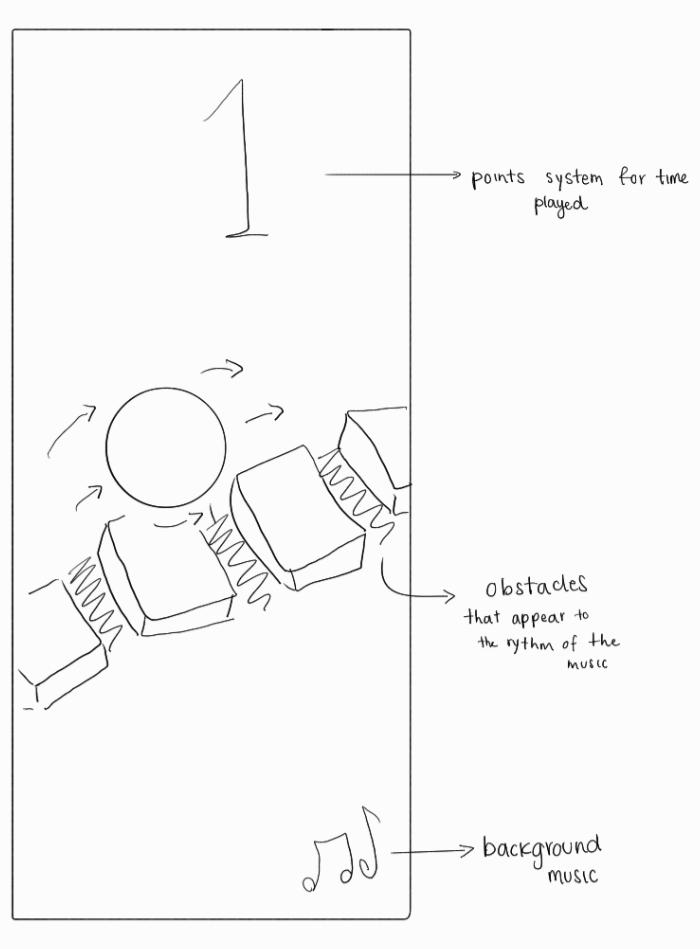
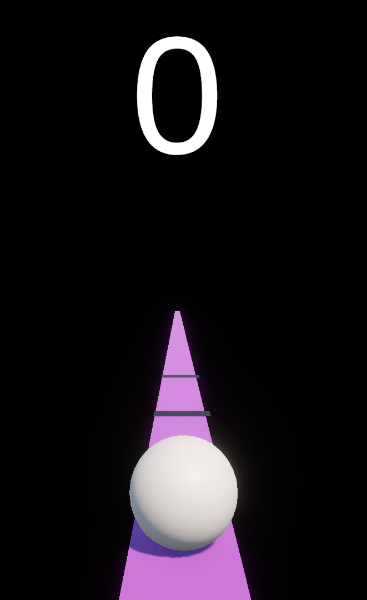

# Beat Bounce

## Team Members
- Verónica Zapata Vargas

## Core Gameplay
**Beat Bounce** is a *rhythm-based runner* where the player controls a sphere that must jump over obstacles generated to the rhythm of the music.  
The obstacles appear synchronized with the *beats* of the song and move toward the player.

The core mechanic is simple:  
Tap the screen or click to jump and avoid collisions with obstacles.  
If the player hits an obstacle, the game restarts.

## Level Progression
The game uses a procedural level generator based on the rhythm of the music.  
As the player advances and accumulates points, the system increases difficulty in the following ways:

1. **Level 1-3 (0–30 points)**  
   - Basic obstacles that appear every 2 beats  
   - Simple and predictable patterns  

2. **Level 4-6 (31–60 points)**  
   - Introduction of random variation in obstacle generation (30% chance to invert the pattern)  
   - 15% increase in obstacle movement speed  

3. **Level 7-9 (61–90 points)**  
   - Obstacles of varying heights that require precise jumps  
   - Some obstacles may require double jumps or shorter jumps  

4. **Level 10+ (91+ points)**  
   - Multiple obstacles appearing simultaneously  
   - Some in quick sequences (every beat)  
   - Brief speed boosts timed with musical *crescendos*  

The system uses the `Random` function to determine what type of obstacles to generate and when to introduce variation.

> **Note:** For this prototype (**v1.0.0**), level progression has not been implemented yet.

---

## Level Diagram

## Game Mockup

